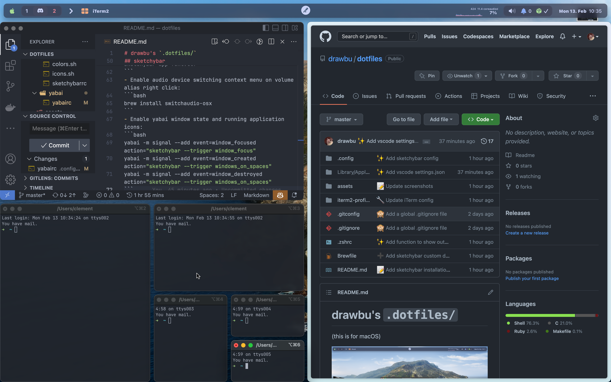

# drawbu's `.dotfiles/`
(this is for macOS)




The wallpaper is the macOS Catalina official dynamic wallpaper (the light scheme change during the day).

## Install Apple's Command Line Tools (this are prerequisites for Git and Homebrew)
```bash
xcode-select --install
```

## Clone the repo
```bash
git clone https://github.com/drawbu/dotfiles ~/dotfiles
```

## Create symlinks
*Except for Brewfile*
```bash
ln -s ~/.dotfiles/.zshrc ~/.zshrc
ln -s ~/.dotfiles/.gitconfig ~/.gitconfig
...
```

## Homebrew
```bash
/bin/bash -c "$(curl -fsSL https://raw.githubusercontent.com/Homebrew/install/HEAD/install.sh)"
brew bundle --file ~/.dotfiles/Brewfilek
```

## Oh-my-zsh
```bash
sh -c "$(curl -fsSL https://raw.githubusercontent.com/ohmyzsh/ohmyzsh/master/tools/install.sh)"
```

## OMZ plugins
```bash
git clone https://github.com/zsh-users/zsh-autosuggestions ${ZSH_CUSTOM:-~/.oh-my-zsh/custom}/plugins/zsh-autosuggestions
git clone https://github.com/zsh-users/zsh-syntax-highlighting.git ${ZSH_CUSTOM:-~/.oh-my-zsh/custom}/plugins/zsh-syntax-highlighting
git clone https://github.com/zsh-users/zsh-completions ${ZSH_CUSTOM:-${ZSH:-~/.oh-my-zsh}/custom}/plugins/zsh-completions
pip install wakatime && cd ~/.oh-my-zsh/custom/plugins && git clone https://github.com/wbingli/zsh-wakatime.git
```

## iTerm2
Go on the GUI preferences, search from a custom folder or URL, check the box, and select the `~/iterm2-profiles` folder.
