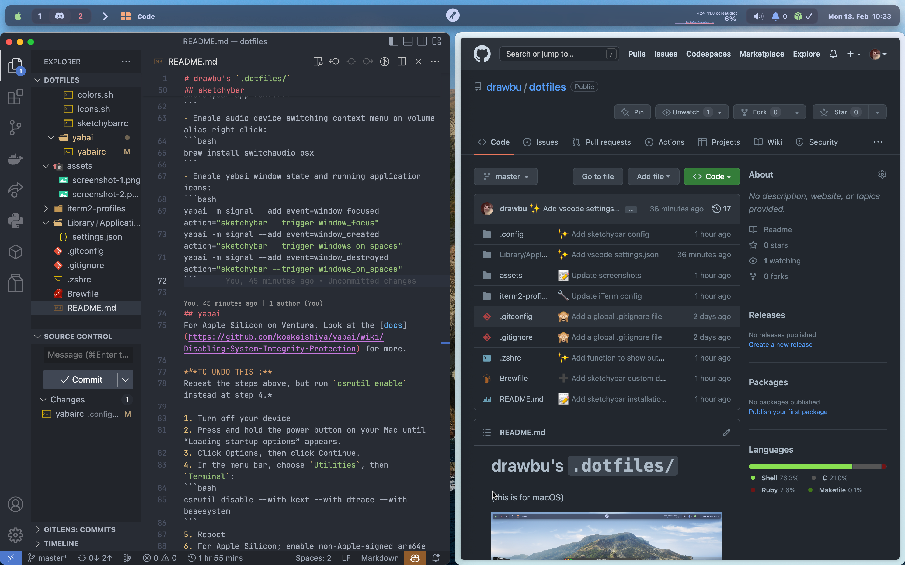
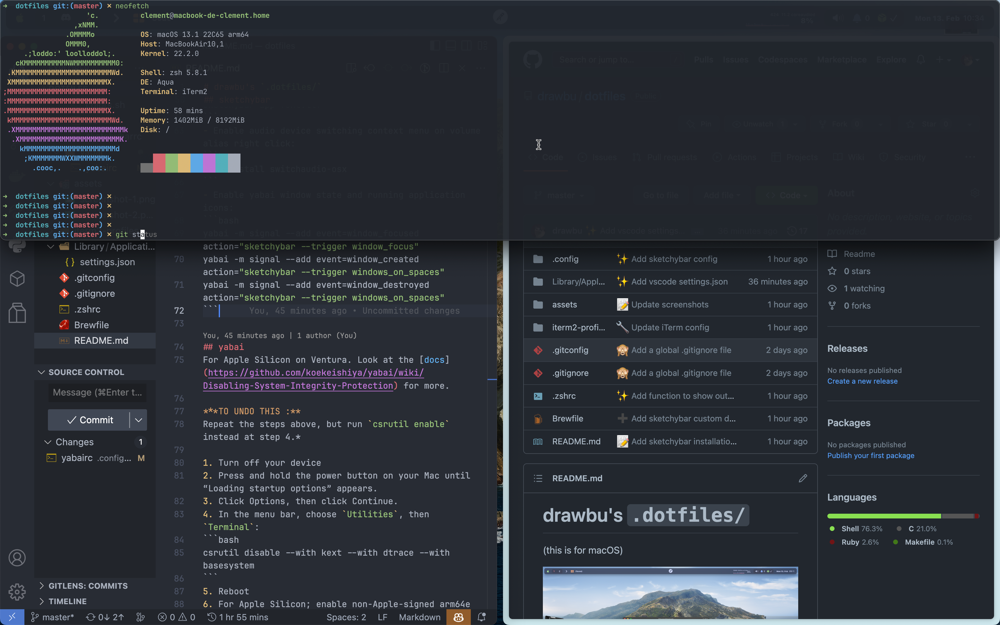
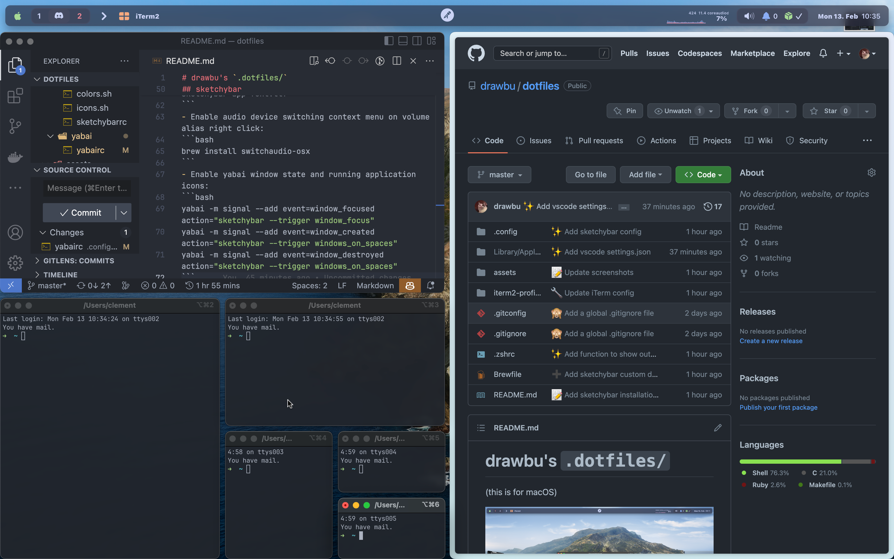

<div align="center">

# My dotfiles for macOS and Arch

<div style="width: 200px; display: flex; justify-content: space-between">
    
    
    
</div>

<samp>Those dotfiles is the config I use mainly on macOS, but also on Linux (Vanilla Arch & Asahi).</samp>

#

</div>





The wallpaper is the macOS Catalina official dynamic wallpaper (the light scheme change during the day).

## Install Apple's Command Line Tools (this are prerequisites for Git and Homebrew)
```bash
xcode-select --install
```

## Clone the repo
```bash
git clone --recursive https://github.com/drawbu/dotfiles $DOTFILE_PATH
```
If the recursive repo cloning failed, run:
```bash
git submodule update --recursive
```
(with `--init` flag if it fails again)

## Create symlinks
_Don't forget to remove the orignal file before setting a symlink at the same 
path!_
```bash
ln -si $DOTFILE_PATH/.zshrc ~/.zshrc
ln -si $DOTFILE_PATH/.config/ ~/.config/
...
```
_Except for Brewfile, see [homebrew step](#homebrew)_

## Homebrew
```bash
/bin/bash -c "$(curl -fsSL https://raw.githubusercontent.com/Homebrew/install/HEAD/install.sh)"
brew bundle --file $DOTFILE_PATH/Brewfile
```

## Zsh & Oh My Zsh & Powerlevel10k
```bash
ln -s $DOTFILE_PATH/.ohmyzsh ~/.ohmyzsh
ln -s $DOTFILE_PATH/.p10k.zsh ~/.p10k.zsh
ln -s $DOTFILE_PATH/.zshrc ~/.zshrc
ln -s $DOTFILE_PATH/.profile ~/.profile
```

## iTerm2
Go on the GUI preferences, search from a custom folder or URL, check the box, and select the `~/.config/iterm2` folder.

To open the terminal on top, press `CTRL`+`SPACE`.
