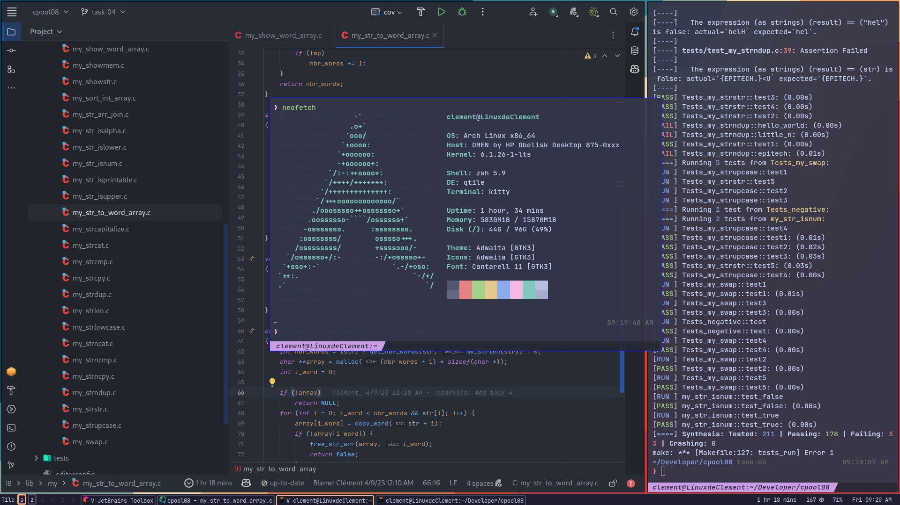
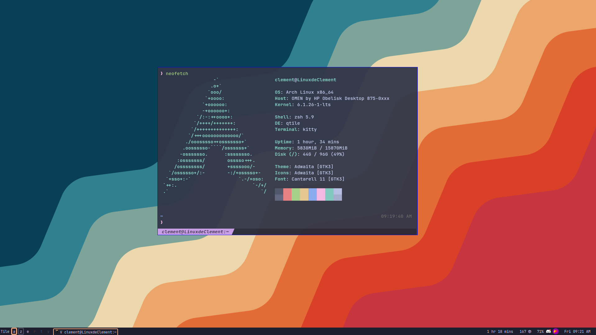
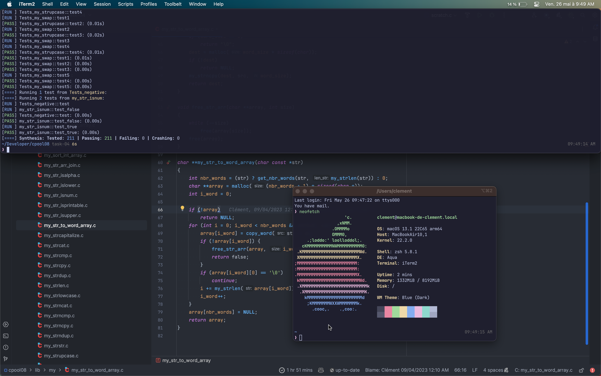
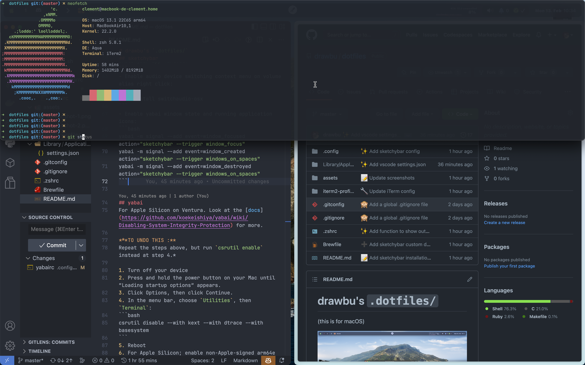

<div align="center">

# My dotfiles for macOS and Arch

<div style="width: 200px; display: flex; justify-content: space-between">
    
    
    
</div>

<samp>
   Those dotfiles is the config I use mainly on macOS, but also on Linux 
   (Vanilla Arch & Asahi).
</samp>

#

</div>


## :building_construction: <samp> TABLE OF CONTENT </samp>

1. [Screenshots](#art--screenshots-)
   1. [Arch](#-arch-)
   2. [macOS](#-macos-)
2. [Installation](#wrench--installation-)
    1. [Install Apple's Command Line Tools](#apples-command-line-tools)
    2. [Clone the repo](#clone-the-repo)
    3. [Create symlinks](#create-symlinks)
    4. [Homebrew](#homebrew)
    5. [Zsh & Oh My Zsh & Powerlevel10k](#zsh--oh-my-zsh--powerlevel10k)
    6. [iTerm2](#iterm2)
    7. [Qtile](#qtile)
    8. [Picom](#picom)


## :art: <samp> SCREENSHOTS </samp>

### <samp> ARCH </samp>
<div style="display: flex">
    
   
</div>

Simple and clean, with [qtile](#qtile) and [picom](#picom).



### <samp> macOS </samp> </h3>





The wallpaper is the macOS Catalina official dynamic wallpaper (the light scheme 
change during the day).


## :wrench: <samp> INSTALLATION </samp>
> **Note**
> For the next steps, im going to refer as the folder you want to put the 
> dotfiles in as `$DOTFILES_PATH`*

### Apple's Command Line Tools
If you're on macOS, you need to install Apple's Command Line Tools, which are 
prerequisites for Git and Homebrew. On any other OS, you don't need it.
```bash
xcode-select --install
```

### Clone the repo
```bash
git clone --recursive https://github.com/drawbu/dotfiles $DOTFILE_PATH
```
If the recursive repo cloning failed, run:
```bash
git submodule update --recursive
```
(with `--init` flag if it fails again)

### Create symlinks
> **Warning**
> Don't forget to remove the orignal file before setting a symlink at the same 
> path!_

You don't have to create symlinks for every file, only the ones you need. The 
`.config` folder is for me a go-to folder for all the config files I need to
symlink.

Exemple:
```bash
ln -si $DOTFILE_PATH/.config ~/.config
```

### Homebrew
Don't symlink the `Brewfile` file, it's only used for the installation of
the packages.

These commands will install Homebrew and all the packages listed in the
`Brewfile` file.
```bash
/bin/bash -c "$(curl -fsSL https://raw.githubusercontent.com/Homebrew/install/HEAD/install.sh)"
brew bundle --file $DOTFILE_PATH/Brewfile
```

### Zsh & Oh My Zsh & Powerlevel10k
```bash
ln -s $DOTFILE_PATH/.ohmyzsh ~/.ohmyzsh
ln -s $DOTFILE_PATH/.p10k.zsh ~/.p10k.zsh
ln -s $DOTFILE_PATH/.zshrc ~/.zshrc
ln -s $DOTFILE_PATH/.profile ~/.profile
```

### iTerm2
Go on the GUI preferences, search from a custom folder or URL, check the box, 
and select the `~/.config/iterm2` folder.

To open the terminal on top, press `CTRL`+`SPACE`.

### Qtile
The Window Manager I use on Linux. It's a tiling window manager written and 
configured in Python. All the config files are in the `.config/qtile` folder.
```bash
pacman -S qtile
```

### Picom
The compositor I use on Linux. It's a lightweight compositor for X11. 
Qtile works fine without it, but it's better with it, as it adds little 
animations and the possibility to play with window opacity.
```bash
pacman -S picom
```

### Nix Home Manager
Installation: [Home Manager Manual](https://nix-community.github.io/home-manager/index.html#sec-install-standalone)

For Linux:
```bash
home-manager switch --flake '.#clement-linux'
```

For macOS:
```bash
home-manager switch --flake '.#clement-darwin'
```
