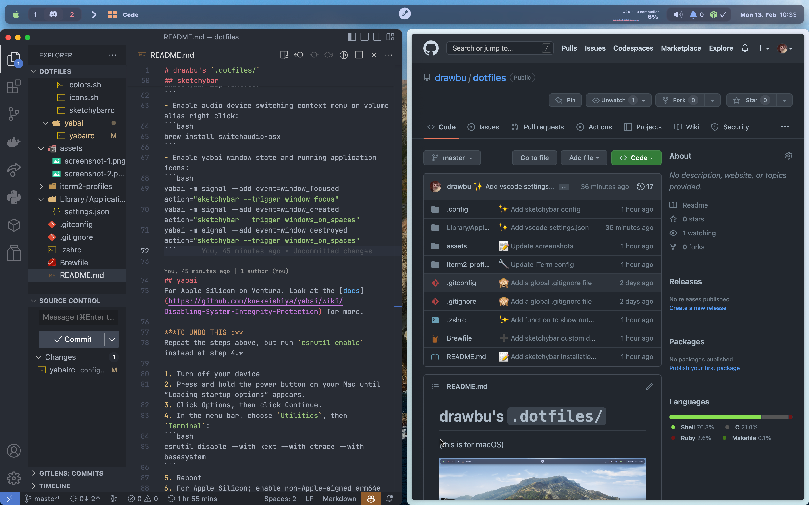

# drawbu's `.dotfiles/`
(this is for macOS)




The wallpaper is the macOS Catalina official dynamic wallpaper (the light scheme change during the day).

## Install Apple's Command Line Tools (this are prerequisites for Git and Homebrew)
```bash
xcode-select --install
```

## Clone the repo
```bash
git clone --recursive https://github.com/drawbu/dotfiles $DOTFILE_PATH
```
If the recursive repo cloning failed, run:
```bash
git submodule update --recursive
```
(with `--init` flag if it fails again)

## Create symlinks
_Don't forget to remove the orignal file before setting a symlink at the same 
path!_
```bash
ln -si $DOTFILE_PATH/.zshrc ~/.zshrc
ln -si $DOTFILE_PATH/.config/ ~/.config/
...
```
_Except for Brewfile, see [homebrew step](#homebrew)_

## Homebrew
```bash
/bin/bash -c "$(curl -fsSL https://raw.githubusercontent.com/Homebrew/install/HEAD/install.sh)"
brew bundle --file ~/.dotfiles/Brewfilek
```

## Oh-my-zsh
```bash
sh -c "$(curl -fsSL https://raw.githubusercontent.com/ohmyzsh/ohmyzsh/master/tools/install.sh)"
rm -rf ~/.oh-my-zsh/custom/
ln -s $DOTFILE_PATH/.oh-my-zsh/custom/ ~/.oh-my-zsh/custom/
```

## iTerm2
Go on the GUI preferences, search from a custom folder or URL, check the box, and select the `~/iterm2-profiles` folder.
To open the terminal on top, press `CTRL`+`SPACE`

## sketchybar
I use a set of plugins from the [FelixKratz's dotfiles](https://github.com/FelixKratz/dotfiles)
```bash
brew services start sketchybar
```
Hide the default macOS menu bar in System Settings -> Desktop & Dock -> Automatically hide and show the menu bar -> Always
- Uses `sf-symbols`: `brew install --cask sf-symbols`
- Uses `jq`: `brew install jq`
- Uses `github-cli`: `brew install gh` (`gh auth login` for notifications)
- Uses `sketchybar-app-font`:
```bash
curl -L https://github.com/kvndrsslr/sketchybar-app-font/releases/download/v1.0.4/sketchybar-app-font.ttf -o $HOME/Library/Fonts/sketchybar-app-font.ttf
```
- Enable audio device switching context menu on volume alias right click:
```bash
brew install switchaudio-osx
```
- Enable yabai window state and running application icons:
```bash
yabai -m signal --add event=window_focused action="sketchybar --trigger window_focus"
yabai -m signal --add event=window_created action="sketchybar --trigger windows_on_spaces"
yabai -m signal --add event=window_destroyed action="sketchybar --trigger windows_on_spaces"
```

## yabai
For Apple Silicon on Ventura. Look at the [docs](https://github.com/koekeishiya/yabai/wiki/Disabling-System-Integrity-Protection) for more.

***TO UNDO THIS :**
Repeat the steps above, but run `csrutil enable` instead at step 4.*

1. Turn off your device
2. Press and hold the power button on your Mac until “Loading startup options” appears.
3. Click Options, then click Continue.
4. In the menu bar, choose `Utilities`, then `Terminal`:
```bash
csrutil disable --with kext --with dtrace --with basesystem
```
5. Reboot
6. For Apple Silicon; enable non-Apple-signed arm64e binaries
```bash
# Open a terminal and run the below command, then reboot
sudo nvram boot-args=-arm64e_preview_abi
```
7. You can verify that System Integrity Protection is turned off by running csrutil status, which returns System Integrity Protection status: disabled. if it is turned off (it may show unknown for newer versions of macOS when disabling SIP partially).


```
brew services start yabai
```
