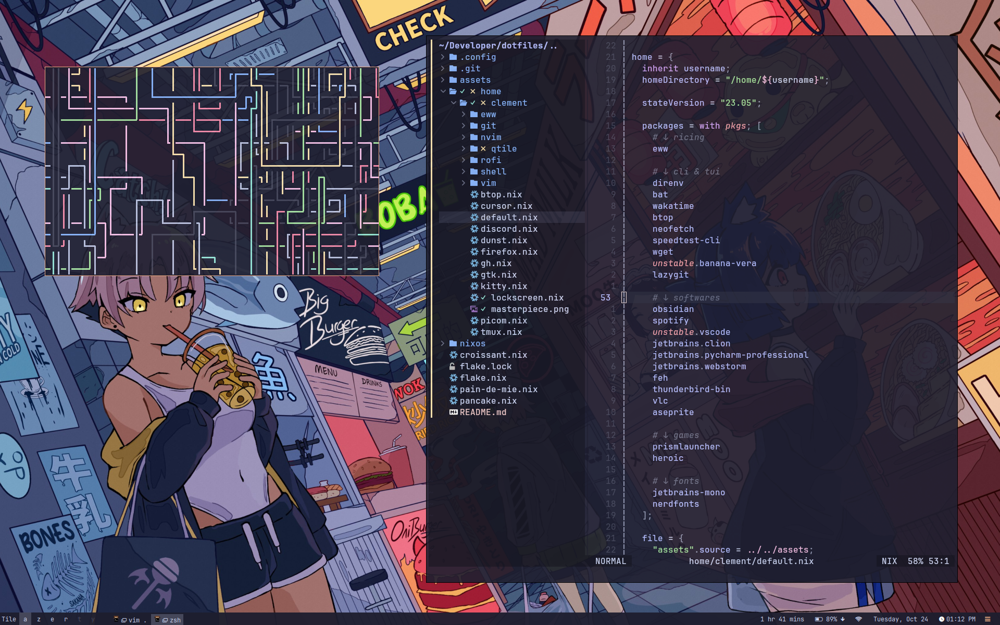
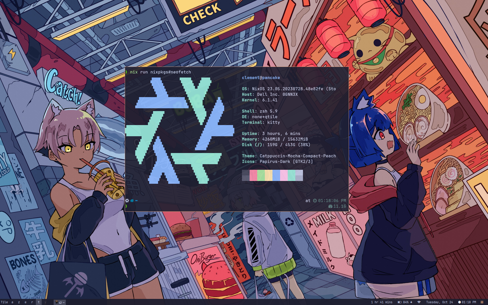

<div align="center">

# My dotfiles for NixOS

<div style="width: 200px; display: flex; justify-content: space-between">
    
</div>

</div>

#

## :art: <samp> SCREENSHOTS </samp>

<div style="display: flex">
    
</div>



Simple and clean, using [qtile](https://github.com/qtile/qtile).

## :snowflake: Installation
```
sudo nixos-rebuild switch --flake github:drawbu/dotfiles#the-machine
```
Replace `the-machine` with one of the following:
 - `pain-de-mie`: For my PC
 - `pancake`: For my laptop
 - `croissant`: For my Contabo VPS (setup [here](https://github.com/drawbu/Notes/blob/main/Server%20administration/Install%20NixOS%20on%20Contabo%20server.md))

And **tada** the pc is up and running, users are created, everything is
installed, and symlinks are linked!
